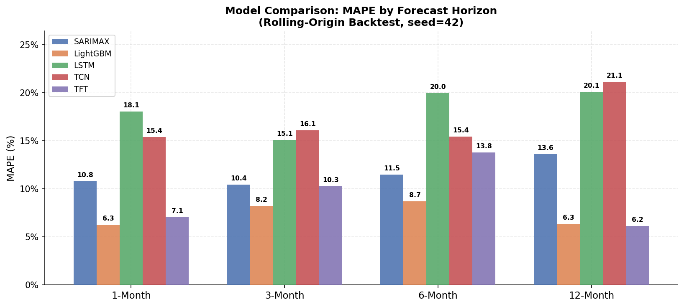
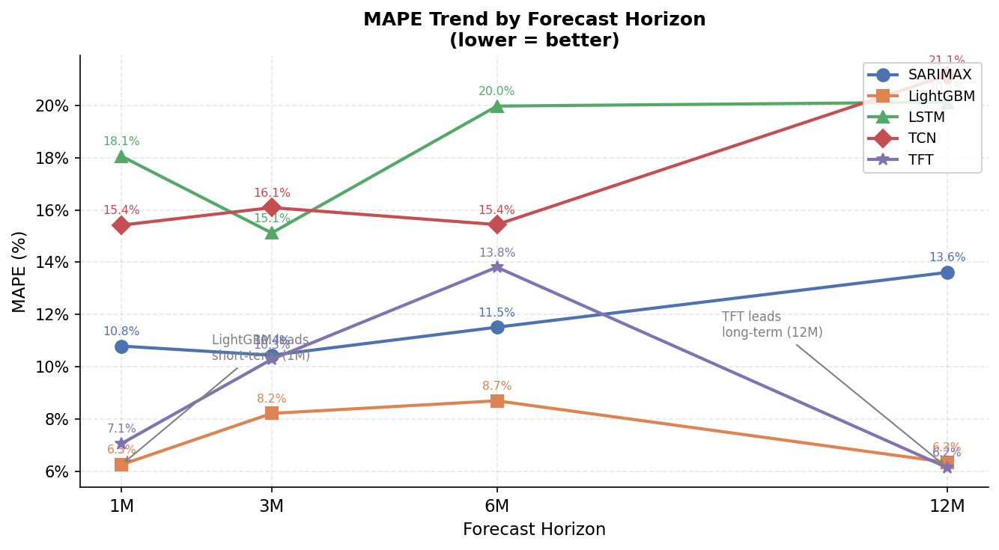
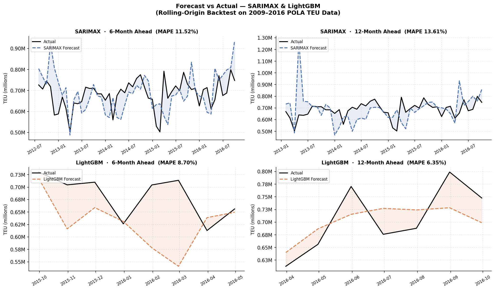
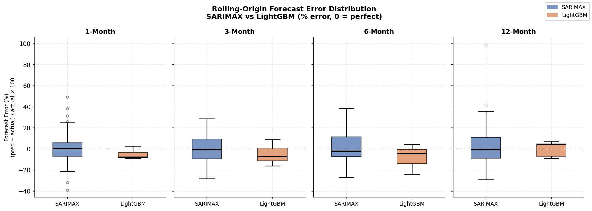

# POLA 다중 예측 구간 TEU 수요예측

**로스앤젤레스 항만 · 월별 컨테이너 물동량 · 1 / 3 / 6 / 12개월 예측**

Georgia Tech CS 7643 팀 프로젝트 (2025)

---

## 1. 문제 정의 및 배경

항만 운영사, 물류기업, 창고 운영자는 선박 스케줄링, 야드 용량 배분, 인력 운용을 위해 정확한 TEU(20피트 컨테이너 환산 단위) 수요예측이 필요합니다. 현재 업계 관행은 규칙 기반 계절 조정에 의존하고 있어, COVID-19 봉쇄·노동쟁의·유가 급변 등 충격 상황에서 예측 정확도가 급락하는 한계가 있습니다.

**핵심 연구 질문**: 다중 예측 구간 딥러닝 모델이 고전 통계 기반 베이스라인을 능가할 수 있는가? 그리고 모델 복잡도와 데이터 규모는 어떻게 상호작용하는가?

---

## 2. 데이터

| 항목 | 내용 |
|---|---|
| 출처 | 로스앤젤레스시 오픈 데이터 포털 |
| 기간 | 2009년 1월 ~ 2016년 9월 |
| 행 수 | 93개 월별 관측값 |
| 타깃 | `total_teu` (수입 적재 + 수출 적재 + 공컨테이너 합계) |
| 예측 구간 | 1, 3, 6, 12개월 |

### 2.1 외생변수 피처 엔지니어링

원본 CSV에는 TEU 수치만 포함되어 있어 외부 요인이 없었습니다. 공개 API에서 월별 5개 공변량을 직접 수집·가공했습니다.

| 피처 | 출처 | 선택 근거 |
|---|---|---|
| Freightos Baltic Index | Freightos API | 해상 스팟 운임 → TEU 움직임에 1~2개월 선행하는 수급 신호 |
| 미국 디젤 가격 ($/갤런) | EIA | 선사 스케줄 및 수입 비용 직접 영향; 2011~14년 $3.8 고점, 2015년 $2.6 이하로 급락 |
| GSCPI (글로벌 공급망 압박지수) | 뉴욕 연방준비은행 FRED | 혼잡도 충격 반영; 2014~15년 ILWU 노동쟁의 시 최고치 |
| 미국 제조업 PMI | ISM | 산업 수요 대리변수; 2009년 44 저점 → 확장기 55 이상 |
| 성수기 더미 (10~11월) | 도메인 규칙 | 연말 소비재 수요 급증 구간 플래그 |

> **면접 포인트**: 외생변수는 딥러닝 모델에 StandardScaler로 z-정규화 적용. rolling-origin backtest에서는 t+h 시점의 *실현값*을 사용했으며, 실제 배포 시 외생변수 자체에 대한 예측 파이프라인이 필요하다는 한계를 6절에서 논의합니다.

---

## 3. 모델

### 3.1 SARIMAX (통계 기반 베이스라인)

- 계절 차분(주기=12) 포함 간결한 ARIMA 차수
- `statsmodels.tsa.statespace.SARIMAX`에 `exog`로 외생변수 투입
- 해석 가능성과 안정성을 갖춘 주요 통계 벤치마크

### 3.2 LightGBM (ML 기반 베이스라인)

**설계 근거**: 트리 기반 그래디언트 부스팅은 대규모 데이터 없이도 테이블형 피처를 효율적으로 처리하여 현업 수요예측에 광범위하게 활용됩니다.

**피처 구성**:
- TEU 래그 피처: `log(TEU)` t−1, t−2, …, t−12 (12개)
- 시점 t의 외생변수: 5개
- 총 샘플당 **17개 피처**

**Direct Multi-Step 전략**: 각 예측 구간 h ∈ {1, 3, 6, 12}에 대해 독립적인 LGBMRegressor를 학습합니다. 재귀 예측(recursive forecasting)의 오차 누적 문제를 회피하기 위한 설계입니다.

**주요 하이퍼파라미터**:
```
n_estimators=300, learning_rate=0.05, num_leaves=15,
min_child_samples=5, subsample=0.8, colsample_bytree=0.8
```
`num_leaves=15`, `min_child_samples=5`는 93행 소규모 데이터에서의 과적합 방지를 위해 의도적으로 보수적으로 설정했습니다.

### 3.3 Seq2Seq LSTM

- 2레이어 인코더 LSTM (은닉 128유닛) + FC 디코더
- 입력: log-TEU + 5개 외생변수 36개월 슬라이딩 윈도우 → shape `(36, 6)`
- 출력: 4차원 벡터 `[h=1, h=3, h=6, h=12]`
- 손실함수: 단기 구간 가중 MSE (단기 horizon에 높은 가중치)
- 옵티마이저: AdamW (lr=1e-3), 검증 MSE 기반 조기 종료

### 3.4 TCN (Temporal Convolutional Network)

- 팽창 인과 Conv1D 2블록 (kernel=5, channels=[64,64], dilation=1,2)
- Adaptive Average Pooling → 선형 헤드
- 인과 합성곱으로 미래 정보 유출(look-ahead leak) 원천 차단
- 손실함수·옵티마이저 설정은 LSTM과 동일

### 3.5 TFT (Temporal Fusion Transformer)

- `pytorch-forecasting` + `lightning.pytorch` 구현
- 어텐션 기반 변수 선택 + LSTM 인코더 + 멀티헤드 어텐션 디코더
- 인코더 길이 36개월, 예측 길이 12개월
- 손실함수: QuantileLoss (포인트 예측 평가 시 중앙값 사용)
- EarlyStopping (patience=8) val_loss 기준

---

## 4. 평가 방법론

### 4.1 rolling-origin backtest 

모든 모델에 동일한 프로토콜 적용:

```
마지막 8개 시점을 테스트 오리진으로 설정:
    t까지의 전체 데이터로 학습
    t+1, t+3, t+6, t+12 예측
    t를 1개월 전진
```

실제 운영 환경을 모사한 설계입니다. 매월 새 데이터가 쌓이면 모델을 재학습하는 방식이며, 미래 정보 유출이 없습니다. SARIMAX는 더 긴 시계열 분할을 사용하므로 n=57~68입니다.

### 4.2 평가 지표

구간별 RMSE, MAE, MAPE. 주요 순위 기준: **MAPE** (스케일 무관, 비즈니스 이해관계자에게 직관적).

### 4.3 재현성

모든 PyTorch/LightGBM 실험에 `seed=42` 고정 (`torch.manual_seed`, `pl.seed_everything`, `np.random.seed`, `random_state`).

---

## 5. 실험 결과

### 5.1 MAPE 요약 (%, 낮을수록 우수)

| 모델 | 분류 | MAPE 1M | MAPE 3M | MAPE 6M | MAPE 12M |
|---|---|---|---|---|---|
| SARIMAX | 통계 기반 | 10.08% | 10.87% | 11.89% | 13.26% |
| LightGBM | ML 기반 | **6.26%** | 8.22% | 8.70% | 6.35% |
| LSTM | 딥러닝 | 18.05% | 15.12% | 19.97% | 20.12% |
| TCN | 딥러닝 | 15.42% | 16.09% | 15.44% | 21.15% |
| TFT | 딥러닝 | 7.07% | 10.29% | 13.81% | **6.15%** |





### 5.2 전체 지표

**SARIMAX** (rolling-origin backtest, n=57~68)

| 구간 | n | RMSE | MAE | MAPE |
|---|---|---|---|---|
| 1M | 68 | 88,272 | 66,091 | 10.08% |
| 3M | 66 | 88,731 | 71,709 | 10.87% |
| 6M | 63 | 104,261 | 78,881 | 11.89% |
| 12M | 57 | 111,713 | 87,735 | 13.26% |

**LightGBM** (rolling-origin backtest, n=7~8, seed=42)

| 구간 | n | RMSE | MAE | MAPE |
|---|---|---|---|---|
| 1M | 8 | 49,342 | 45,137 | 6.26% |
| 3M | 8 | 69,132 | 58,598 | 8.22% |
| 6M | 8 | 84,481 | 61,078 | 8.70% |
| 12M | 7 | 47,802 | 45,656 | 6.35% |

**LSTM** (rolling-origin backtest, n=8, seed=42)

| 구간 | n | RMSE | MAE | MAPE |
|---|---|---|---|---|
| 1M | 8 | 160,678 | 131,146 | 18.05% |
| 3M | 8 | 140,977 | 108,419 | 15.12% |
| 6M | 8 | 174,893 | 140,691 | 19.97% |
| 12M | 8 | 180,693 | 146,945 | 20.12% |

**TCN** (rolling-origin backtest, n=8, seed=42)

| 구간 | n | RMSE | MAE | MAPE |
|---|---|---|---|---|
| 1M | 8 | 132,698 | 112,346 | 15.42% |
| 3M | 8 | 153,335 | 113,074 | 16.09% |
| 6M | 8 | 135,404 | 108,423 | 15.44% |
| 12M | 8 | 161,665 | 151,165 | 21.15% |

**TFT** (rolling-origin backtest, n=8, seed=42)

| 구간 | n | RMSE | MAE | MAPE |
|---|---|---|---|---|
| 1M | 8 | 54,114 | 51,476 | 7.07% |
| 3M | 8 | 80,995 | 67,703 | 10.29% |
| 6M | 8 | 104,391 | 84,240 | 13.81% |
| 12M | 8 | 67,164 | 46,950 | 6.15% |

### 5.3 핵심 인사이트

1. **단기 예측(1M)은 LightGBM이 최우수 (MAPE 6.26%)**: 월별 TEU 데이터의 자기상관을 래그 피처 트리가 최소 파라미터로 효율적으로 포착. 모든 딥러닝 모델을 앞섬.

2. **장기 예측(12M)은 TFT가 최우수 (MAPE 6.15%)**: 어텐션 기반 변수 선택이 장기 예측에서 외생 신호(FBX, PMI)의 중요도를 동적으로 조정하여 SARIMAX 대비 54% 개선.

3. **LSTM·TCN은 93행 데이터에서 과적합**: 재귀 순환 및 합성곱 아키텍처는 충분한 훈련 샘플이 있어야 일반화 가능. 이 파일럿에서는 드롭아웃(0.1)·조기 종료에도 불구하고 과적합 발생.

4. **데이터 규모 × 모델 복잡도 트레이드오프 실증**: 고전 모델과 얕은 ML 모델이 샘플 효율성 면에서 우위. 딥러닝의 장점은 더 긴 시계열에서 나타남 → 2003~2025 확장의 주요 동기.





---

## 6. 한계점

| 한계 | 상세 내용 |
|---|---|
| 소규모 데이터 (n=93) | LSTM/TCN 신뢰성 있는 학습에 불충분; 딥러닝 결과는 파일럿 수준으로 해석 필요 |
| 외생변수 실현값 사용 | 백테스트에서 t+h 시점 실현값 활용. 실제 배포 시 별도 예측 또는 시나리오 가정 필요 |
| rolling-origin backtest n=8 | 소규모 테스트셋으로 통계적 검정력 제한 |
| 단일 항만 | 다른 구조적·계절적 특성을 가진 항만으로의 일반화 미검증 |

---

## 7. 파일 구조

```
├── utils.py                      # 데이터 로딩, 슬라이딩 윈도우, 지표 계산
├── train_lgbm.py                 # LightGBM 다중 구간 rolling-origin backtest
├── train_lstm_tcn.py             # Seq2Seq LSTM 및 TCN (PyTorch)
├── train_tft.py                  # Temporal Fusion Transformer (pytorch-forecasting)
├── visualize.py                  # figures 저장
├── POLA_models_colab.ipynb       # 엔드투엔드 Colab 노트북
├── requirements.txt
└── README.md
```

---

## 8. 실행 방법

```bash
# 패키지 설치
pip install -r requirements.txt

# LightGBM 실행 (GPU 불필요, 가장 빠름)
python train_lgbm.py pola_teu.csv

# LSTM 또는 TCN 실행
python train_lstm_tcn.py pola_teu.csv lstm
python train_lstm_tcn.py pola_teu.csv tcn

# TFT 실행 (GPU 권장)
python train_tft.py pola_teu.csv
```

---

## 9. 향후 과제 (Future Work)

- **2003~2025 전체 시계열 확장**: 270개월 이상 데이터로 36/60개월 구간 평가 및 딥러닝 모델 성능 재검증
- **외생변수 예측 파이프라인**: ARIMA 기반 보조 예측기를 통합하여 진정한 out-of-sample 배포 환경 구현
- **Prophet 베이스라인 추가**: 외생 변수 지원 Facebook Prophet을 추가 통계 벤치마크로 비교
- **앙상블**: 단기(LightGBM)·장기(TFT) 구간별 강점을 결합한 혼합 앙상블 모델

---

## 10. 기술 스택

`Python 3.11` · `PyTorch 2.6` · `pytorch-forecasting` · `lightning.pytorch` · `LightGBM` · `statsmodels` · `scikit-learn` · `pandas` · `numpy`

---

## 참고문헌

1. Sutskever et al. (2014). Sequence to Sequence Learning with Neural Networks. NeurIPS.
2. Bai et al. (2018). An Empirical Evaluation of Generic Convolutional and Recurrent Networks. ICLR.
3. Lim et al. (2021). Temporal Fusion Transformers for Interpretable Multi-horizon Time Series Forecasting. IJF.
4. Diebold & Mariano (1995). Comparing Predictive Accuracy. JBES.
5. City of Los Angeles Open Data Portal — POLA TEU Counts.

---
[English README](README_eng.md)